# Informe Técnico: Arquitectura de la SPA PharmaSoft
**Actividad Autónoma — Sesión 7**  
*Módulo Clientes y Revisión de Arquitectura*

- **Estudiante:** Samuel Vilca
- **Curso:** Lenguaje de Programación II
- **Docente:** Reyna Barreto Benjamin David
- **Ciclo:** IV · Semestre 2026-2
- **Rama Git:** `feature/clientes-vilca`
- **Pull Request:** `https://github.com/<usuario>/pharma-frontend/pull/1` hacia `develop`

---

## B1. Estructura del Proyecto

### Árbol de Carpetas (`src/app`)

```text
src/app
│   app.config.ts
│   app.routes.ts
│   app.ts
│
├───core
│   ├───config
│   │       menu.ts
│   ├───models
│   │       error-response.ts
│   │       pagina-response.ts
│   └───utils
│           http-error.ts
│
├───features
│   ├───categorias
│   │   │   categorias.routes.ts
│   │   ├───models
│   │   │       categoria.model.ts
│   │   ├───pages
│   │   │   ├───categoria-form
│   │   │   │       categoria-form.css
│   │   │   │       categoria-form.html
│   │   │   │       categoria-form.ts
│   │   │   └───categoria-list
│   │   │           categoria-list.css
│   │   │           categoria-list.html
│   │   │           categoria-list.ts
│   │   └───services
│   │           categoria-service.ts
│   │
│   ├───clientes
│   │   │   clientes.routes.ts
│   │   ├───models
│   │   │       cliente.model.ts
│   │   ├───pages
│   │   │   ├───cliente-form
│   │   │   │       cliente-form.css
│   │   │   │       cliente-form.html
│   │   │   │       cliente-form.ts
│   │   │   └───cliente-list
│   │   │           cliente-list.css
│   │   │           cliente-list.html
│   │   │           cliente-list.ts
│   │   └───services
│   │           cliente-service.ts
│   │
│   └───inicio
│           inicio.html
│           inicio.ts
│
├───layout
│   ├───header
│   │       header.css
│   │       header.html
│   │       header.ts
│   ├───main-layout
│   │       main-layout.css
│   │       main-layout.html
│   │       main-layout.ts
│   └───sidebar
│           sidebar.css
│           sidebar.html
│           sidebar.ts
│
└───shared
    └───pages
        └───no-encontrado
                no-encontrado.ts
```

### Organización por Capas

- **`core/`**: Aloja las piezas singulares y transversales a toda la aplicación. Contiene configuraciones globales como el arreglo de navegación (`menu.ts`), modelos de datos genéricos como la envoltura paginada (`pagina-response.ts`) y la estructura de errores de la API (`error-response.ts`), además de utilidades reutilizables para el parseo de respuestas HTTP y mapeo de excepciones de Spring Boot (`http-error.ts`).
- **`shared/`**: Contiene componentes, directivas o tuberías reutilizables por múltiples módulos que no pertenecen a un dominio de negocio específico, como la página de error 404 (`no-encontrado.ts`).
- **`layout/`**: Define la estructura visual persistente de la SPA mediante CSS Grid. Contiene el encabezado (`Header`), el menú lateral reactivo (`Sidebar`) y el contenedor principal (`MainLayout`), el cual aloja el `<router-outlet />` donde se proyectan las vistas secundarias sin recargar el marco exterior.
- **`features/`**: Agrupa los módulos funcionales del negocio de forma aislada e independiente (`inicio`, `categorias`, `clientes`). Cada módulo encapsula sus propios modelos, páginas, servicios y sub-rutas, permitiendo su desarrollo, mantenimiento y carga diferida (*lazy loading*) sin afectar a los demás.

---

## B2. Mapa de Rutas de la Aplicación

| Ruta (URL) | Componente | ¿Ruta padre? | Tipo de carga | Título |
| :--- | :--- | :--- | :--- | :--- |
| `/inicio` | `Inicio` | `MainLayout` | `loadComponent` (diferida) | Inicio |
| `/categorias` | `CategoriaList` | `MainLayout` | `loadChildren` (diferida) | Categorías |
| `/categorias/nuevo` | `CategoriaForm` | `MainLayout` | `loadChildren` (diferida) | Nueva categoría |
| `/categorias/:id/editar` | `CategoriaForm` | `MainLayout` | `loadChildren` (diferida) | Editar categoría |
| `/clientes` | `ClienteList` | `MainLayout` | `loadChildren` (diferida) | Clientes |
| `/clientes/nuevo` | `ClienteForm` | `MainLayout` | `loadChildren` (diferida) | Nuevo cliente |
| `/clientes/:id/editar` | `ClienteForm` | `MainLayout` | `loadChildren` (diferida) | Editar cliente |
| `/**` | `NoEncontrado` | Ninguna (raíz) | `loadComponent` (diferida) | Página no encontrada |

---

## B3. Tabla de Responsabilidades

| Pieza | Tipo | Responsabilidad | Qué **NO** hace |
| :--- | :--- | :--- | :--- |
| **`ClienteService`** | Servicio (`@Service`) | Centralizar la comunicación HTTP con `/api/v1/clientes`, enviar parámetros de paginación/orden y retornar `Observable` tipados. | No manipula el DOM, no muestra alertas o mensajes ni navega entre páginas. |
| **`ClienteList`** | Componente | Administrar las señales de estado de la tabla de clientes (página, tamaño, orden, filtro, datos, carga y error) y reaccionar a eventos del usuario. | No realiza peticiones HTTP directas con `HttpClient` ni conoce las URLs del backend. |
| **`ClienteForm`** | Componente | Gestionar el formulario reactivo de cliente, ejecutar validaciones síncronas de interfaz, emitir peticiones de guardado/edición y mapear errores del backend. | No realiza llamadas HTTP directas ni define las rutas de la aplicación. |
| **`CategoriaService`** | Servicio (`@Service`) | Realizar las peticiones HTTP CRUD hacia `/api/v1/categorias` y devolver `Observable` de categorías. | No maneja lógica visual, estado de formularios ni interacción con el usuario. |
| **`CategoriaList`** | Componente | Controlar el estado del catálogo de categorías con Signals, filtrar en memoria con `computed()` y coordinar la confirmación de eliminación. | No construye peticiones HTTP nativas ni navega directamente en respuestas fallidas. |
| **`CategoriaForm`** | Componente | Construir y validar el formulario de categorías (nombre y descripción) y detectar el modo edición mediante el binding `:id/editar`. | No gestiona la persistencia de datos ni interactúa con la API sin el servicio. |
| **`Header`** | Componente | Renderizar la marca PharmaSoft, los enlaces generales y emitir el evento `toggleMenu` mediante `output<void>()` al presionar ☰. | No decide cómo se colapsa la cuadrícula ni almacena el estado de visibilidad del sidebar. |
| **`Sidebar`** | Componente | Iterar sobre el arreglo `MENU` con `@for` para mostrar los accesos a los módulos y resaltar la ruta activa con `routerLinkActive`. | No define las rutas de la aplicación ni controla el colapso del menú lateral. |
| **`MainLayout`** | Componente | Definir la cuadrícula CSS Grid general, coordinar el estado reactivo del menú (`menuColapsado`) y proyectar las vistas hijas en `<router-outlet />`. | No conoce la lógica de negocio de los módulos ni procesa datos de clientes o categorías. |

---

## B4. Flujo de una Operación: «Registrar Cliente»

### Diagrama de Secuencia

```mermaid
sequenceDiagram
    autonumber
    actor Usuario
    participant V as ClienteForm (Vista)
    participant S as ClienteService
    participant API as PharmaBackend (API REST)
    participant Router as Angular Router
    participant List as ClienteList (Signals)

    Usuario->>V: Clic en botón "Registrar"
    V->>V: Validar formulario reactivo (dni, nombres, etc.)
    alt Formulario inválido
        V-->>Usuario: Muestra mensajes de validación y detiene el flujo
    else Formulario válido
        V->>V: Normalizar DTO (convertir campos vacíos a null)
        V->>S: crear(clienteRequest)
        S->>API: POST /api/v1/clientes (JSON)
        alt Caso Exitoso: 201 Created
            API-->>S: 201 Created (ClienteResponseDTO)
            S-->>V: Observable emit (next)
            V->>Router: navigate(['/clientes'])
            Router->>List: Carga vista de listado
            List->>S: listar(pagina=0, ...)
            S->>API: GET /api/v1/clientes?pagina=0...
            API-->>S: 200 OK (PaginaResponseDTO)
            S-->>List: Actualiza signal respuesta()
            List-->>Usuario: Renderiza tabla con la nueva fila
        else Caso Error: 409 Conflict (DNI o Correo Duplicado)
            API-->>S: 409 Conflict (ErrorResponseDTO)
            S-->>V: Observable error (HttpErrorResponse)
            V->>V: Desactiva guardando()
            V->>V: Extrae mensaje con mensajeError(err)
            V->>V: Actualiza signal error() y erroresServidor()
            V-->>Usuario: Muestra alerta roja superior con mensaje del backend
        end
    end
```



---

## B5. Preguntas de Revisión

### 1. ¿Cuántos archivos existentes tuviste que modificar para agregar el módulo Clientes? Nómbralos. ¿Qué dice ese número sobre la arquitectura?
Se modificaron únicamente **2 archivos existentes** del proyecto:
1. `src/app/core/config/menu.ts` (Línea 10): Se agregó la entrada `{ etiqueta: 'Clientes', ruta: '/clientes', icono: '👥' }`.
2. `src/app/app.routes.ts` (Líneas 20–24): Se registró la ruta diferida `clientes` usando `loadChildren`.

Este número reducido (solo 2 archivos) demuestra que la arquitectura cumple estrictamente el **Principio Abierto/Cerrado (Open/Closed Principle)**: la aplicación está abierta a la extensión pero cerrada a la modificación. Se incorporó una entidad completa de negocio con paginación, formularios y servicios sin alterar ni una sola línea de los módulos existentes (Categorías, Inicio, Layout), garantizando un bajísimo acoplamiento y alta cohesión.

### 2. ¿Por qué el componente de listado no usa HttpClient directamente? ¿Qué pasaría si mañana cambia la URL de la API?
El componente `ClienteList` (`src/app/features/clientes/pages/cliente-list/cliente-list.ts`, Línea 15) no consume `HttpClient` directamente para preservar el **Principio de Responsabilidad Única (SRP)**: el componente solo debe gestionar el estado de la vista y la interacción del usuario, mientras que la comunicación y parametrización de red corresponden a `ClienteService`. Si mañana cambia la URL o versión de la API (por ejemplo de `/api/v1/clientes` a `/api/v2/clientes`), **solo se modificaría una única línea** en `cliente-service.ts` (Línea 11). Si los componentes usaran `HttpClient` directamente, se tendría que buscar y editar manualmente cada componente de la aplicación, multiplicando el esfuerzo y el riesgo de inconsistencias.

### 3. ¿Qué ventaja concreta tiene cargar Clientes con `loadChildren` en lugar de importar sus componentes en `app.routes.ts`? Verifícalo con `ng build` y copia la línea del chunk de clientes que aparece en la salida.
La ventaja concreta es la **Carga Diferida (*Lazy Loading*)** y la optimización del rendimiento en la carga inicial (*First Contentful Paint*). El código TypeScript, plantillas y estilos del módulo Clientes no se descargan cuando el usuario entra por primera vez a la SPA, sino únicamente bajo demanda cuando navega a `/clientes`.  
En la salida de `ng build` se evidencia la generación del fragmento independiente:
```text
chunk-CSEw7eoM.js   | clientes-routes   |  12.73 kB |                 3.82 kB
```
Esto certifica que los 12.73 kB del módulo se descargan en un archivo separado y no saturan el paquete principal inicial (`main.js`).

### 4. ¿Por qué el encabezado y el sidebar no se vuelven a dibujar al pasar de Categorías a Clientes?
Porque tanto el `Header` como el `Sidebar` están alojados dentro del componente contenedor `MainLayout` (`src/app/layout/main-layout/main-layout.ts`), el cual actúa como componente padre en la configuración de rutas de `app.routes.ts` (Línea 7). Al navegar entre rutas secundarias (`/categorias` y `/clientes`), el enrutador de Angular mantiene intacta la instancia del `MainLayout` y sus hijos directos, y se limita a destruir y montar el componente correspondiente dentro del `<router-outlet />` ubicado en el área `main`.

### 5. Si en la sesión 11 algunos usuarios no deben ver «Clientes», ¿en qué archivo harías el cambio y por qué bastaría con ese punto?
El cambio se realizaría centralizadamente en `src/app/core/config/menu.ts` (o en un servicio de autenticación que filtre el arreglo `MENU` según los roles o claims del token JWT del usuario conectado). Bastaría con ese punto porque el componente `Sidebar` (`src/app/layout/sidebar/sidebar.html`, Línea 3) no tiene enlaces estáticos quemados en su HTML, sino que genera su menú dinámicamente iterando sobre `MENU` con `@for (item of menu; track item.ruta)`. Al excluir el ítem del arreglo, el enlace desaparece inmediatamente de la interfaz visual.

### 6. ¿Qué parte del código de Categorías y Clientes está duplicada? Propón una forma de reutilizarla, aunque no la implementes.
Existe duplicación en el manejo del estado del listado: las señales de estado `cargando`, `error`, `filtro`, la lógica de debounce o filtrado `computed()`, y el patrón de diálogo de confirmación `confirm()` al eliminar o dar de baja con captura de `mensajeError(err)`.  
**Propuesta de reutilización:** Se puede abstraer esta lógica creando una función genérica componible (*composable pattern*) en `core/utils/` o `shared/` denominada `useCrudList<T>(servicio, opciones)` o una clase base abstracta `BaseCrudList<T>`. Esta utilidad gestionaría internamente las señales comunes (`cargando`, `error`, `filtro`) y los métodos de ciclo de vida (`cargar()`, `confirmarAccion()`), reduciendo el código en cada componente a la mera invocación de la función pasándole el servicio correspondiente.

### 7. El buscador de Clientes solo filtra la página actual. Explica por qué ocurre y qué tendría que cambiar en el backend y en `ClienteService` para buscar entre todos los clientes.
Ocurre porque la señal computada `filtrados = computed(...)` en `cliente-list.ts` (Líneas 27–40) filtra localmente en la memoria del navegador únicamente sobre los elementos presentes en `this.respuesta()?.contenido`, el cual contiene únicamente los 10 registros de la página devuelta por el servidor.  
**Para buscar entre todos los clientes:**
1. **En el Backend (`PharmaBackend`):** `ClienteRepository` debe implementar una consulta derivada o `@Query` como `findByDniContainingOrNombresContainingIgnoreCaseOrApellidosContainingIgnoreCase(String texto, Pageable pageable)`, y `ClienteController` debe admitir un parámetro opcional `@RequestParam(required = false) String buscar`.
2. **En el Frontend (`ClienteService`):** El método `listar()` en `cliente-service.ts` debe incorporar el parámetro `buscar?: string` en los `HttpParams`.
3. **En `ClienteList`:** Al escribir en el buscador, no se filtraría en memoria mediante `computed`, sino que se actualizaría una señal de búsqueda que desencadene una llamada a `clienteService.listar(...)`, reiniciando la paginación a la página 0.

---

## B6. Casos de Prueba para Evidencias (Paso A7)

| N.º | Acción | Resultado Esperado | Detalle en Pestaña Red (F12) |
| :---: | :--- | :--- | :--- |
| **1** | Entrar a «Clientes» desde el sidebar | Primera página de clientes cargada y opción «Clientes» resaltada. | `GET /api/v1/clientes?pagina=0&tamanio=10...` (200 OK). |
| **2** | Cambiar el tamaño a 5 y pulsar «Siguiente» | Carga la página 2 con 5 registros; texto indica «Página 2 de X». | `GET /api/v1/clientes?pagina=1&tamanio=5...` (200 OK). |
| **3** | Ordenar por apellidos y volver a hacer clic | Tabla invierte su ordenamiento de ascendente a descendente. | `GET ...&direccion=asc` y luego `direccion=desc`. |
| **4** | Registrar un cliente con DNI de 7 dígitos | Muestra mensaje: *"El DNI es obligatorio y debe tener exactamente 8 dígitos"*. | No se envía petición al servidor (validación local). |
| **5** | Registrar cliente válido sin teléfono ni dirección | Registro exitoso y redirección al listado; teléfono muestra «—». | `POST /api/v1/clientes` con campos opcionales en `null` (201 Created). |
| **6** | Registrar otro cliente con el mismo DNI o correo | Alerta roja superior con mensaje del backend. | `POST /api/v1/clientes` con error `409 Conflict`. |
| **7** | Editar el teléfono con 9 dígitos | Formulario precarga datos; al guardar actualiza el registro. | `PUT /api/v1/clientes/{id}` (200 OK). |
| **8** | Buscar por parte del DNI y luego por apellido | La tabla filtra en tiempo real en la página actual. | **Sin peticiones HTTP** (operación por `computed()`). |
| **9** | Dar de baja un cliente activo | Cuadro de confirmación; tras aceptar, la fila muestra «Inactivo». | `DELETE /api/v1/clientes/{id}` (204 No Content). |
| **10** | Intentar dar de baja otra vez al mismo cliente | Alerta con el mensaje de regla de negocio del backend. | `DELETE /api/v1/clientes/{id}` (409 Conflict). |
| **11** | Volver al módulo «Categorías» | El módulo Categorías funciona con total normalidad. | Navegación instantánea por rutas sin recargar la SPA. |
